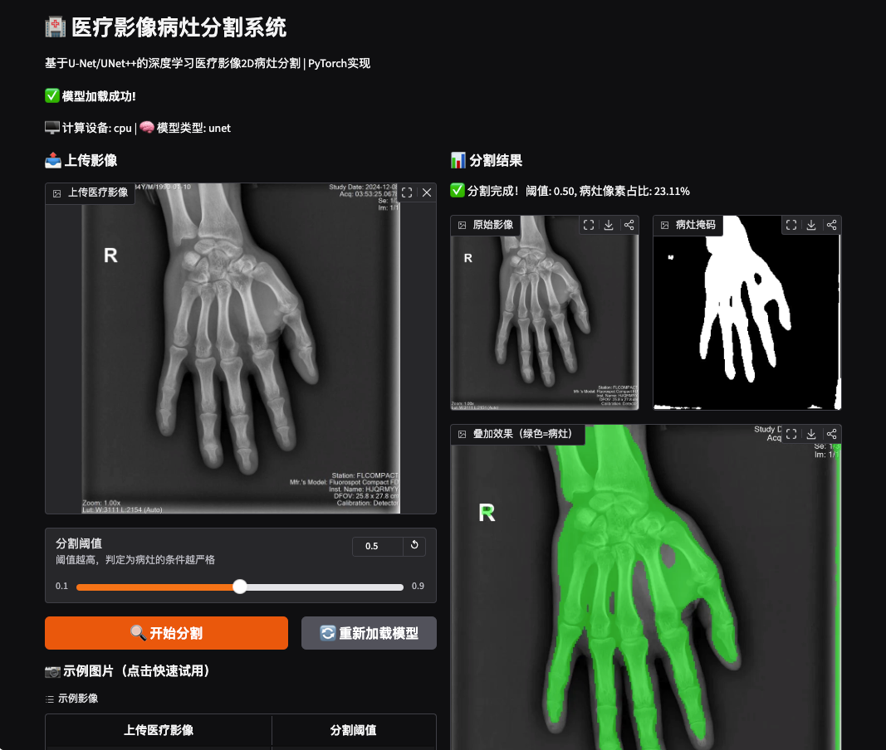
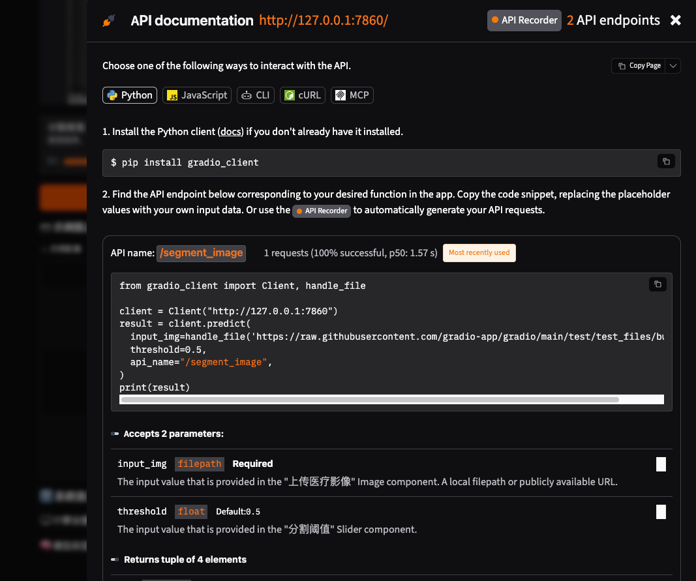

<div align="center">

# 🏥 MedicalSeg: 医疗影像病灶分割系统

基于 PyTorch 的 2D 医疗影像病灶分割完整解决方案，支持 U-Net / UNet++，开箱即用的 Web 交互界面

[](https://pytorch.org/)
[](https://www.python.org/)
[](LICENSE)
[](https://gradio.app/)

**开箱即用 | 中文注释 | 适合毕设 | 跨平台**

[功能特性](#-功能特性) • [快速开始](#-快速开始) • [项目结构](#-项目结构) • [使用指南](#-使用指南) • [自定义数据集](#%EF%B8%8F-自定义数据集)

</div>

---

## 📸 效果预览

### Web 交互界面


### 分割结果展示


---

## ✨ 功能特性

### 📦 开箱即用
- **零数据启动**：内置模拟数据生成脚本，无需准备真实医疗影像即可体验完整流程
- **Web UI**：基于 Gradio 的拖拽式交互界面，上传图片即可一键分割
- **预训练配置**：提供快速演示配置（10轮CPU训练）和完整训练配置（50轮）
- **跨平台**：完美兼容 Windows / Linux / macOS，GPU/CPU 自动检测切换

### 🧠 模型架构
- 支持 **U-Net** 经典分割网络（编码器-解码器跳跃连接）
- 支持 **UNet++** 嵌套跳跃连接网络（可选深度监督）
- 一键切换模型，通过 YAML 配置文件灵活调整参数
- 支持迁移学习微调（修改配置即可加载预训练权重）

### 🩻 数据处理
- 支持多种医疗影像格式：**DICOM (.dcm)**、**NIfTI (.nii/.nii.gz)**、**JPG/PNG 普通图像**
- 内置医疗影像预处理流水线：
  - CLAHE 限制对比度自适应直方图均衡化（灰度矫正）
  - 高斯滤波去噪
  - 图像归一化与尺寸统一（默认 256×256）
  - 数据增强：随机水平/垂直翻转、随机旋转
- 自动数据集划分（训练集:验证集:测试集 = 7:2:1）
- 掩码标签自动对齐

### 📊 训练优化
- **混合损失函数**：Dice Loss + Focal Loss 加权组合，解决医疗影像正负样本不均衡问题
- **优化器**：AdamW 优化器（权重衰减解耦）
- **学习率调度**：支持 CosineAnnealingLR、StepLR、ReduceLROnPlateau
- **早停机制**：监控验证集 Dice 系数，防止过拟合
- **梯度裁剪**：防止梯度爆炸
- **混合精度训练**：支持 AMP 加速（GPU 环境）

### 📈 评估指标
训练和验证过程实时输出医疗分割核心指标：
- **Dice 系数**（Dice Similarity Coefficient）- 分割重叠度
- **IoU 交并比**（Jaccard Index）
- **Precision 精确率**
- **Recall 召回率**
- **Accuracy 准确率**

### 🎨 可视化
- 分割结果三图对比：原始影像 | 病灶掩码 | 叠加效果图（绿色高亮病灶）
- 自动绘制训练曲线：损失曲线、Dice 曲线、IoU 曲线
- 训练日志完整记录，支持 TensorBoard
- Matplotlib 中文字体自动配置

### 🔌 工程化
- **模块化设计**：数据处理、模型、训练、推理、可视化完全解耦
- **配置驱动**：所有超参数通过 YAML 文件管理，无需修改代码
- **推理接口预留**：提供 Predictor 类，支持批量推理和单张预测
- **FastAPI 接口**：预留 REST API 接口，方便二次开发部署
- **代码规范**：全程中文详细注释，变量命名清晰，无冗余复杂算子

---

## 🚀 快速开始

### 1. 环境准备

```bash
# 克隆项目
git clone https://github.com/yourusername/MedicalSeg.git
cd MedicalSeg

# 安装依赖
pip install -r requirements.txt
```

> 💡 推荐使用 Python 3.8+，PyTorch 2.0+

### 2. 生成模拟数据（5秒完成，无需真实数据）

```bash
python tools/generate_sim_data.py --num_samples 100 --img_size 256
```

### 3. 快速训练演示（CPU 约 10-15 分钟）

```bash
# 使用快速演示配置（10轮，轻量U-Net）
python tools/train.py --config configs/demo.yaml
```

训练完成后，最佳模型权重会自动保存到 `checkpoints/best_model.pth`

### 4. 启动 Web 界面体验

```bash
python app.py
```

浏览器访问 **http://localhost:7860** ，即可：
- 点击示例图片快速体验
- 上传自己的医疗影像
- 拖动滑块调整分割阈值
- 实时查看三图对比结果

---

## 📁 项目结构

```
MedicalSeg/
├── 📂 configs/             # 配置文件目录
│   ├── default.yaml        # 默认完整训练配置（50轮）
│   └── demo.yaml           # 快速演示配置（10轮）
├── 📂 medicalseg/          # 核心代码包
│   ├── 📂 io/              # 数据IO模块（多格式读取）
│   │   ├── image_reader.py     # JPG/PNG读取
│   │   ├── dicom_reader.py     # DICOM读取
│   │   └── nifti_reader.py     # NIfTI读取
│   ├── 📂 datasets/        # 数据集与预处理
│   │   ├── transforms.py       # 数据增强与预处理变换
│   │   ├── seg_dataset.py      # 分割数据集类
│   │   └── base_dataset.py
│   ├── 📂 models/          # 模型定义
│   │   ├── unet.py             # U-Net实现
│   │   ├── unetpp.py           # UNet++实现
│   │   ├── layers.py           # 基础网络层
│   │   └── model_factory.py    # 模型工厂（一键创建）
│   ├── 📂 training/        # 训练相关
│   │   ├── losses.py           # 损失函数（Dice/Focal/混合）
│   │   ├── metrics.py          # 评估指标
│   │   ├── optimizer.py        # 优化器与调度器
│   │   ├── early_stopping.py   # 早停机制
│   │   └── trainer.py          # 训练器核心
│   ├── 📂 inference/       # 推理模块
│   │   └── predictor.py        # 推理器封装
│   ├── 📂 visualization/   # 可视化
│   │   ├── plotter.py          # 训练曲线绘制
│   │   └── visualizer.py       # 分割结果可视化
│   └── 📂 utils/           # 工具函数
│       ├── config.py           # YAML配置加载
│       ├── device.py           # GPU/CPU设备检测
│       ├── logger.py           # 日志记录
│       └── seed.py             # 随机种子固定
├── 📂 tools/               # 命令行脚本
│   ├── generate_sim_data.py    # 生成模拟数据
│   ├── train.py                # 训练入口
│   ├── predict.py              # 批量推理
│   └── plot_curves.py          # 绘制训练曲线
├── app.py                  # Gradio Web界面
├── api.py                  # FastAPI接口预留
├── requirements.txt        # 依赖清单
├── ScreenShot_*.png        # 效果预览截图
├── .gitignore
├── LICENSE
└── README.md
```

---

## 📖 使用指南

### 完整训练（适合正式训练）

```bash
# 使用默认配置训练U-Net++（50轮）
python tools/train.py

# 指定配置文件
python tools/train.py --config configs/default.yaml
```

### 批量推理预测

训练完成后，对测试集进行批量预测并保存结果：

```bash
python tools/predict.py \
    --checkpoint checkpoints/best_model.pth \
    --input_dir data/raw/simulated/images \
    --output_dir outputs/predictions \
    --threshold 0.5
```

### 绘制训练曲线

```bash
python tools/plot_curves.py --log_dir logs
```

### 启动 API 服务

```bash
# 需要先安装 uvicorn: pip install uvicorn
uvicorn api:app --host 0.0.0.0 --port 8000
```

访问 http://localhost:8000/docs 查看 API 文档。

---

## 🗂️ 自定义数据集

### 目录结构

将你的数据集组织成以下结构：

```
your_dataset/
├── images/          # 原始影像
│   ├── 001.png
│   ├── 002.png
│   └── ...
└── masks/           # 标注掩码（二值图，病灶区域为1/255）
    ├── 001.png
    ├── 002.png
    └── ...
```

> 💡 支持的格式：PNG/JPG/JPEG/BMP（普通图像）、DCM（DICOM）、NII/NII.GZ（NIfTI，自动提取2D切片）

### 修改配置

编辑 `configs/default.yaml`，修改 `paths.data_dir` 为你的数据集路径：

```yaml
paths:
  data_dir: "path/to/your_dataset"  # 修改这里
```

然后开始训练即可：

```bash
python tools/train.py
```

---

## ⚙️ 配置说明

主要配置项在 [configs/default.yaml](configs/default.yaml) 中：

| 配置项 | 默认值 | 说明 |
|--------|--------|------|
| `data.img_size` | 256 | 输入图像尺寸（正方形） |
| `data.batch_size` | 4 | 批大小 |
| `model.name` | unetpp | 模型选择：unet / unetpp |
| `model.base_channels` | 64 | 起始通道数（越小模型越轻量） |
| `training.epochs` | 50 | 训练轮数 |
| `training.lr` | 1e-3 | 初始学习率 |
| `training.patience` | 10 | 早停耐心值（0禁用） |
| `training.dice_weight` | 0.5 | Dice Loss权重 |
| `training.focal_weight` | 0.5 | Focal Loss权重 |
| `loss.focal_alpha` | 0.8 | Focal Loss正样本权重 |
| `optimizer.type` | adamw | 优化器：adam/adamw/sgd |
| `training.scheduler` | cosine | 学习率调度器 |

---

## 🔧 常见问题

### Q1: CUDA out of memory 怎么办？
减小 `batch_size`，例如改为 2 或 1；或者减小 `model.base_channels` 到 32。

### Q2: 训练速度慢？
- GPU 环境：确保安装了 CUDA 版本的 PyTorch
- CPU 环境：使用 `configs/demo.yaml` 快速演示，或减小图像尺寸、数据量

### Q3: Dice 系数很低？
- 检查掩码是否正确（病灶区域应为白色/1，背景为黑色/0）
- 尝试增加训练轮数
- 调整 `focal_alpha`（正样本比例越小，alpha应越大）
- 检查数据归一化是否正确

### Q4: 如何处理3D NIfTI影像？
NIfTI 读取器会自动提取中间切片进行2D分割。如需3D分割，可基于现有框架扩展3D U-Net。

---

## 📝 更新日志

- **v1.0.0** (2026-07-28)
  - 🎉 首个正式版本发布
  - ✅ U-Net / UNet++ 双模型支持
  - ✅ DICOM / NIfTI / JPG/PNG 多格式读取
  - ✅ DiceFocal 混合损失函数
  - ✅ Gradio Web 交互界面
  - ✅ FastAPI 接口预留
  - ✅ 完整中文注释和文档

---

## 📄 许可证

本项目采用 [MIT License](LICENSE) 开源协议，可自由用于学习、研究和商业项目，但请保留原作者信息。

---

## 🤝 贡献

欢迎提交 Issue 和 Pull Request！

如果这个项目对你有帮助，欢迎点个 ⭐ Star 支持一下！

---

<div align="center">

**Made with ❤️ for medical AI research and education**

如果用于毕业设计/课程设计，请注明出处哦～

</div>
